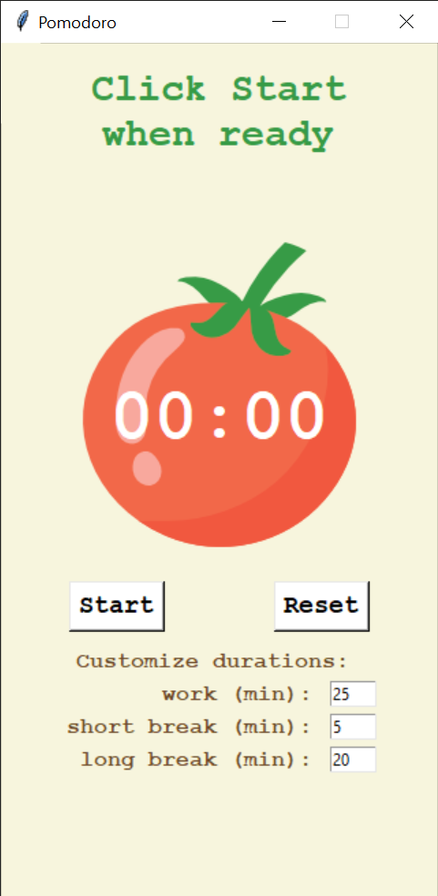

# Pomodoro Timer — Day 28 of 100 Days of Python

A fully functional Pomodoro Timer built with Python and tkinter. Supports customizable work and break durations, tracks completed rounds with tomato icons, and displays progress toward the next long break.


---

## Features

### Core (Original Project Requirements)
- Automatic cycling through work → short break → work → long break
- Visual progress tracking with 🍅 tomato icons
- Color-coded timer label (green = work, pink = short break, red = long break)
- Start and Reset buttons

### Added Enhancements (Beyond Original Requirements)
- **Customizable durations** — entry fields pre-filled with classic Pomodoro defaults (25/5/20 min) that the user can override before starting
- **Input validation** — non-integer entries revert to default values automatically
- **Rounds feedback** — displays how many work rounds remain until the next long break
- **Cycle-capped tomatoes** — 🍅 icons reset after each cycle of 4, following the classic Pomodoro standard
- **Total pomodoros count** — tracks and displays cumulative completed pomodoros since last reset
- **Completion flash on reset** — briefly shows total completed pomodoros when the timer is reset
- **Prevents stacked timers** — start button is disabled after first click to prevent multiple countdown loops

---

## How It Works

### Timer Sequence
The classic Pomodoro Technique cycles through reps in this order:

```
work(1) → short break(2) → work(3) → short break(4) →
work(5) → short break(6) → work(7) → long break(8) → repeat
```

Odd reps are work rounds, even reps are short breaks, and every 8th rep is a long break.

### Rep Tracking Logic

```python
if reps % 8 == 0:       # long break
elif reps % 2 == 0:     # short break
else:                   # work round
```

### Rounds Until Long Break

```python
rounds_left = floor((8 - (reps % 8)) / 2)
```

| reps | rounds_left |
|------|-------------|
| 1    | 3           |
| 3    | 2           |
| 5    | 1           |
| 7    | 0           |

---

## Key Concepts

### `window.after()` — Non-Blocking Countdown

```python
# window.after(delay_ms, function, arg) schedules a function call without freezing the UI.
# Unlike time.sleep(), it works with tkinter's event loop keeping the window responsive.
def count_down(count):
    window.after(1000, count_down, count - 1)
```

`time.sleep()` freezes the entire Tkinter window. `window.after()` schedules the next call while keeping the UI responsive. Each call to `count_down` schedules the next one, creating a recursive countdown loop.

### `highlightthickness=0` — Removing the Focus Border

```python
canvas = Canvas(width=200, height=224, bg=YELLOW, highlightthickness=0)
```

Tkinter draws a highlight border around widgets that have keyboard focus. Setting `highlightthickness=0` removes this border so the canvas renders flush with no extra visual frame — essential for clean drawing surfaces.

### String Formatting with `:02d`

```python
# :02d pads single digit numbers with a leading zero (e.g. 5 → "05")
canvas.itemconfig(timer_text, text=f"{count_minute:02d}:{count_second:02d}")
```

Without `:02d`, a count of 5 seconds would display as `"1:5"` instead of `"01:05"`.

### Disabling the Start Button

```python
# Disable start button on first click to prevent multiple window.after() loops
# from stacking up. Save window.after() return value to cancel on reset.
start_button.config(state="disabled")
```

Every click of Start launches a new countdown loop. Disabling the button after the first click prevents multiple loops from running simultaneously.

### Break Notification Without Stealing Focus

```python
# Brings the window to the front visually when a break starts
# without taking keyboard focus away from whatever the user is working on.
window.lift()
window.attributes("-topmost", True)
window.attributes("-topmost", False)
```

`window.lift()` raises the window visually. Setting `-topmost` to `True` then immediately `False` is a Windows trick that forces the window to the front of the stack without keeping it permanently on top.

### `resource_path()` — Bundling Files with PyInstaller

```python
def resource_path(relative_path):
    """Get the correct path to a resource whether running as script or exe."""
    if hasattr(sys, '_MEIPASS'):
        return os.path.join(sys._MEIPASS, relative_path)
    return os.path.join(os.path.abspath("."), relative_path)
```

When PyInstaller bundles the app, image files are extracted to a temporary folder at runtime. `resource_path()` resolves the correct path whether the app is running as a script or a compiled executable.

### Fixing Window Resize on Dynamic Text

```python
# timer_label width is fixed in character units so dynamic text changes
# do not cause the window to resize on each rep cycle.
timer_label = Label(width=15, ...)
```

---

## Strong vs Dynamic Typing in Python

These are two separate but related concepts that describe how Python handles data types.

### Dynamic Typing

Variables are not locked to a type — they can be reassigned to a different type at runtime.

```python
x = 0           # x is an int
print(type(x))  # <class 'int'>

x = "00"        # x is now a string — Python allows this
print(type(x))  # <class 'str'>
```

### Strong Typing

Python will not silently convert incompatible types for you. You must convert explicitly.

```python
count = 5

# raises TypeError — Python won't guess
result = count + "00"

# must convert explicitly
result = str(count) + "00"   # "500"
result = count + int("10")   # 15
```

Compare to JavaScript (weakly typed), which would silently return `"500"` without error.

### Both Concepts Together — Countdown Timer Example

```python
count_min = floor(count / 60)        # int — result of math operation
count_sec = count % 60               # int — result of modulo operation

if count_sec < 10:
    count_sec = f"0{count_sec}"      # str — variable reassigned from int to string

canvas.itemconfig(timer_text, text=f"{count_min}:{count_sec}")
```

- `count_sec` starts as an `int` from the modulo operation, then gets reassigned to a `str` → **dynamic typing**
- Python would raise a `TypeError` if you tried to do math on `count_sec` after reassignment without converting back → **strong typing**

One-line summary: Python is **dynamically typed** (variables can change type freely) but **strongly typed** (it will not mix incompatible types silently without explicit conversion).

---

## Tech Stack

| Tool | Purpose |
|---|---|
| Python 3 | Core language |
| Tkinter | GUI framework |
| `math` | `floor()` for rep and countdown calculations |
| `sys`, `os` | `resource_path()` for PyInstaller compatibility |

---

## Installation

No external dependencies. Tkinter is included with the standard Python installation.

```
# Clone the repo
git clone https://github.com/yourusername/pomodoro-timer.git
cd pomodoro-timer
```

---

## How to Run

```
python main.py
```

---

## Building the Executable (Windows)

Requires PyInstaller:

```
pip install pyinstaller
```

From the project folder in PowerShell or Command Prompt, run:

```
python -m PyInstaller --onefile --windowed --add-data "tomato.png;." main.py
```

The executable is created in the `dist` folder. Any time you make changes to the code, rerun the above command to rebuild.

### Pinning to the Windows Taskbar

1. Open the `dist` folder in File Explorer
2. Right click `main.exe` and select `Pin to taskbar`
3. After a rebuild, unpin the old shortcut and re-pin the new `main.exe`

### Note on Image Files

PyInstaller does not automatically bundle image files. The `--add-data` flag handles this. If you add more image files to the project, update the command accordingly:

```
python -m PyInstaller --onefile --windowed --add-data "tomato.png;." --add-data "other_image.png;." main.py
```

---

## Project Structure

pomodoro-timer/
│
├── main.py        # Main application
├── tomato.png     # Tomato image used in canvas
└── README.md      # This file

---

## What's Next

- [ ] Sound alert when a timer ends
- [ ] Desktop notification when switching between work and break
- [ ] Daily or session statistics (total focus time, total breaks)
- [ ] Pause and resume button mid-countdown
- [ ] Theme switcher with preset color themes
- [ ] Keyboard shortcut to start and reset (spacebar)
- [ ] Window always-on-top toggle

---

## Author

Built by Rocio Segura as part of the [100 Days of Code: Python](https://www.udemy.com/course/100-days-of-code/) curriculum.