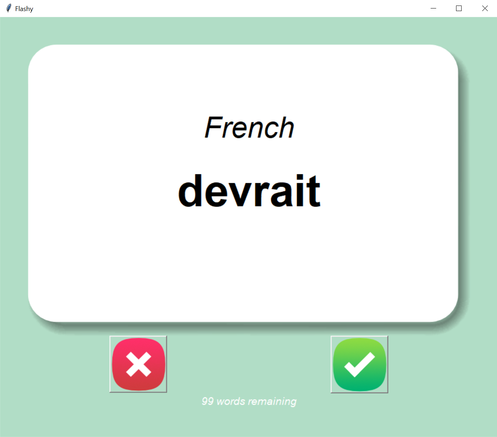

# Flashy — Flash Card Learning App
### 100 Days of Python | Day 31

A dynamic flash card desktop app built with Python and Tkinter for learning new languages and concepts. The app supports any two-column CSV language file, tracks known words across sessions, and is built around a modular class-based architecture that makes it easy to extend with new languages and features.

---

## Preview



---

## Features

### Core Features (Day 31 Requirements)
- Flash card UI with front and back card images
- Random card selection from a loaded language CSV
- Auto-flip timer that reveals the translation after a set delay
- Unknown button to skip to the next card
- Known button to remove a word from the deck permanently
- Progress saved to a CSV file named after the language pair

### Enhancements (Above and Beyond)

**Class-Based Architecture**
The entire app is built around a `FlashCardApp` class, with all UI elements and logic encapsulated as instance variables and methods. This eliminates stale lambda capture bugs, removes the need for global declarations across functions, and makes the codebase significantly cleaner and easier to extend.

**Dynamic Language Support**
The app extracts column names from the CSV at load time rather than hardcoding language names. Any two-column CSV (word, translation) works automatically — swap in a Spanish, Japanese, or vocabulary file and the card labels, flip logic, and progress file naming all update without any code changes.

**User-Configurable Flip Delay**
At startup, the user is prompted to choose how many seconds before the card flips automatically (1–10 seconds). The delay is stored as `self.flip_delay_ms` and applied on every card throughout the session.

**File Picker for Language Selection**
Instead of hardcoding a file path, the user selects their language CSV via a file picker dialog at startup. If no file is selected, the user is prompted to retry or exit cleanly.

**Dynamic Progress File Naming**
The progress CSV is automatically named after the language pair — for example `French_English_to_learn.csv` — so progress files never collide across different language sets.

**Words Remaining Counter**
A live label below the buttons shows how many words are left in the current session, updating every time a card is marked as known.

**Robust File Validation and Error Handling**
On file load, the app validates that the CSV has exactly two columns and handles empty files, malformed CSVs, and unexpected errors — each with a descriptive error dialog and a prompt to choose another file.

---

## Tech Stack

| Tool | Purpose |
|---|---|
| Python 3 | Core language |
| Tkinter | GUI framework |
| `filedialog` | File picker dialog for language selection |
| `simpledialog` | Integer input dialog for flip delay |
| `messagebox` | Error and confirmation dialogs |
| pandas | Loading CSV data and saving progress |
| `pathlib` | Cross-platform file path construction |
| `random` | Random card selection |
| Pillow (PIL) | Image handling |

---

## Installation

```bash
# Clone the repo
git clone https://github.com/yourusername/100-days-python-journey.git
cd day-31-flash-card-capstone

# Install dependencies
pip install pandas pillow
```

> `tkinter`, `random`, and `pathlib` are all part of Python's standard library — no install needed.

---

## How to Run

```bash
python main.py
```

On first launch you will be prompted to set your flip delay and choose a language CSV file. A progress file named `{language}_{translation}_to_learn.csv` is created automatically in the `data/` folder the first time you mark a word as known.

---

## Exception Handling Coverage

| Exception | Where | What it handles |
|---|---|---|
| `pd.errors.EmptyDataError` | `load_data()` | CSV file exists but contains no data |
| `pd.errors.ParserError` | `load_data()` | CSV file is malformed or corrupted |
| `ValueError` (manual) | `load_data()` | CSV does not have exactly 2 columns |
| `Exception` (catch-all) | `load_data()` | Any unexpected error during file load |
| No file selected | `choose_language()` | User closes dialog without picking a file |

---

## Project Structure

```
day-31-flash-card-capstone/
│
├── main.py                            # Entry point — initializes window and FlashCardApp
├── src/
│   ├── flashcard_app.py               # FlashCardApp class — all UI and app logic
│   ├── data_loader.py                 # CSV loading utility
│   └── config.py                      # File paths and color constants
├── images/
│   ├── card_front.png
│   ├── card_back.png
│   ├── right.png
│   └── wrong.png
├── data/
│   ├── french_words.csv               # Source language data
│   └── French_English_to_learn.csv   # Auto-generated progress file
└── README.md
```

---

## Troubleshooting

**PyCharm shows red squiggly underlines on imports from `src/` but the app runs fine**
PyCharm's static analyzer doesn't execute `sys.path.insert()`, so it can't resolve imports from `src/` without a hint. Fix:
1. Right-click the `src/` folder in the Project panel
2. Select **Mark Directory as → Sources Root**
3. If squiggles persist: **File → Invalidate Caches → check all boxes → Invalidate and Restart**

---

## What's Next

- [ ] Migrate language data from CSV to JSON to support richer metadata per word — difficulty rating, times seen, times correct, and last seen date
- [ ] Implement spaced repetition logic using the metadata above — show harder or less recently seen words more frequently
- [ ] Replace file picker with a custom language selection dialog listing available files in the `data/` folder
- [ ] Track session stats — cards seen, known, remaining — with a summary at session end
- [ ] Add a progress bar in addition to the words remaining counter

---

## Author

Built by Rocio Segura as part of the [100 Days of Code: Python](https://www.udemy.com/course/100-days-of-code/) curriculum.